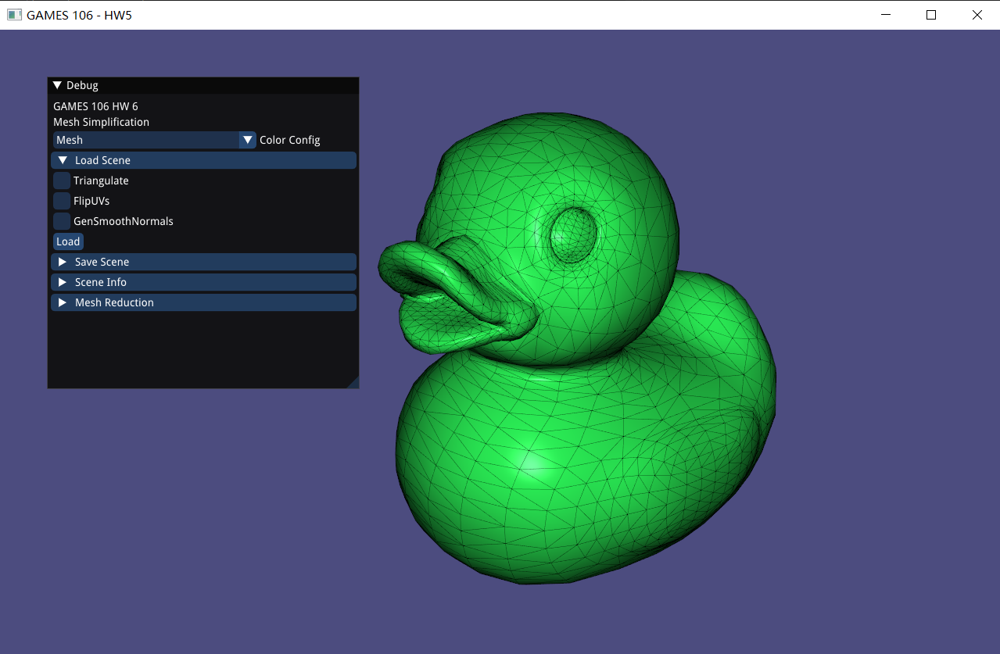

# GAMES106-HW5
GAMES 106 Homework5: Mesh Reduction

## Build

Run following commands:

```shell
mkdir build
cd build
cmake ..
cmake --build ./
```

Run `GAMES106-HW5.exe` in Debug/Release folder and load a scene, you may see:


